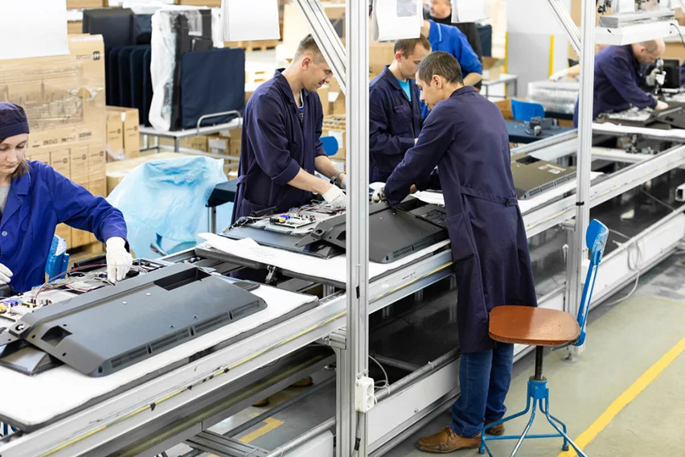

<h1 align="center" style="color:Darkred;"> <u> <b>Assembly Line Manufacturing <b></u> </h1>

<h2>Table Of content</h2>

<ul>
  <li> Overview </li>
  <li> History</li>
  <li> Purpose</li>
  <li> How it shaped the 20th century</li>
  <li> Conrtibuted towards the economic success</li>
  <li> Advantages and disadvantages of assembly line manufacturing</a> </li>
  <li>Conclusion</li>
</ul>

<u><h2>Overview</h2></u>

Assembly line manufacturing is a highly efficient method of production that involves dividing the manufacturing process into sequential tasks performed by specialised workers or machines.

An assembly line is a method of manufacturing where products are made by moving them through a series of workstations, with each workstation performing a specific task.

<u><h2 style="color:black;">History</h2></u>

Assembly line manufacturing came into being as a result of the efforts of Henry Ford, an American industrialist, in the early 20th century. He wanted to find a way to make cars faster, cheaper, and more efficiently.

<h2><u>Purpose</u></h2>

The purpose of assembly line manufacturing is to increase production efficiency, reduce costs, and improve consistency by dividing the production process into sequential tasks performed by specialized workers or machines. It aims to achieve high-volume production, quality control, and time savings.

<u><h2 style="color:black;">How it shaped the 20th century.</h2></u>

Assembly line manufacturing had a significant impact on shaping the 20th century. Here are a few ways it influenced the world:

<li>Mass Production</li>
<li>Economic Growth</li>
<li>Technological Advancements</li>
<li>Social Impact</li>

Overall, assembly line manufacturing transformed industries, economies, and societies. It brought about increased production, affordability, and technological progress, leaving an indelible mark on the 20th century and shaping the world we live in today.

<h2 style="color:black;"><u>Contributed towards the economic successes</h2></u>

Assembly line manufacturing has made significant contributions to economic successes in various ways:

<ul>
<li>Increased Productivity</li>
<li>Cost Reduction</li>
<li>Mass Production and Affordability</li>
<li>Job Creation</li>
<li>Technological Advancements</li>
<li>Competitiveness and Global Trade</li>
</ul>

Overall, assembly line manufacturing has played a crucial role in driving economic successes by increasing productivity, reducing costs, creating jobs, fostering technological advancements, and facilitating global trade. It has been instrumental in shaping economies and fueling economic growth worldwide.

<u><h2 style="color:black;"> Advantages of Assembly Line Manufacturing:</h2></u>

<h3 style="color:black; display:inline ">Increased productivity: </h3>
 
 Assembly lines enable faster production rates, optimised workflows, and streamlined processes, resulting in improved overall productivity.
   
<h3 style="color:black; display:inline">Cost reduction:</h3>

By achieving economies of scale, standardising processes, and minimising waste, assembly line manufacturing can lead to cost reductions in production.
  

<h3 style="color:black; display:inline">Specialisation:</h3>

 Workers on assembly lines can specialise in specific tasks, becoming more skilled and efficient in their respective areas.
  

<u><h2 style="color:black;">Disadvantages of Assembly Line Manufacturing: </h2></u>
<h3 style="display:inline" >Monotony and Worker Fatigue:</h3>

Assembly line work can be repetitive and monotonous, leading to reduced job satisfaction and increased worker fatigue.
   
<h3 style="color:black; display:inline ">Lack of Creativity and Autonomy:  </h3> Workers may have limited decision-making authority or creative input, as their tasks are often highly specialised and repetitive.
 
<h3 style="color:black; display:inline ">Dependency on Equipment and Technology:</h3>

Assembly line manufacturing heavily relies on machinery and automation, making the process vulnerable to equipment failures or technological glitches.
   

<h3 style="color:black; display:inline ">Limited Flexibility:</h3>

Assembly lines are designed for specific products and may not easily accommodate changes or customization, limiting flexibility in production.
   

<h3 style="color:black; display:inline ">Worker Displacement:</h3>
 
Increased automation in assembly line manufacturing can lead to job displacement as machines replace human workers in certain tasks.
   

 <h1><u>Conclusion</h1></u>

 Assembly line manufacturing offers numerous benefits, including increased productivity, cost reduction, and consistent quality. However, it also presents challenges in worker engagement, flexibility, and equipment maintenance. By understanding these considerations and implementing best practices, companies can harness the advantages of assembly line manufacturing while addressing its potential limitations.

